    

#  Hi there, I'm Max 

- 💡Interested in Cryptography, Artificial Intelligence, Compute, Consciousness, and Purpose.
- 📖 Have worked with Python, C++, MATLAB, SQL, System Verilog, RISCV, Lua, Rust, many more.
- 🔭 I’m currently working on my master’s thesis on improving post quantum signature schemes by instantiating the HAWK framework with remarkable lattices.
- 🌱 Currently Learning about cryptography
- 📚 I love reading about consciousness, cryptography and historical mathematicians & physicists
  

